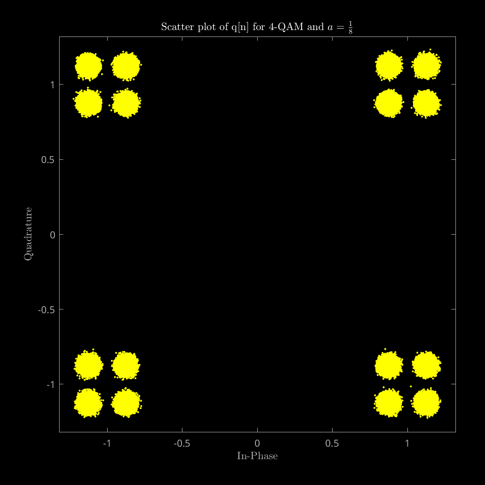
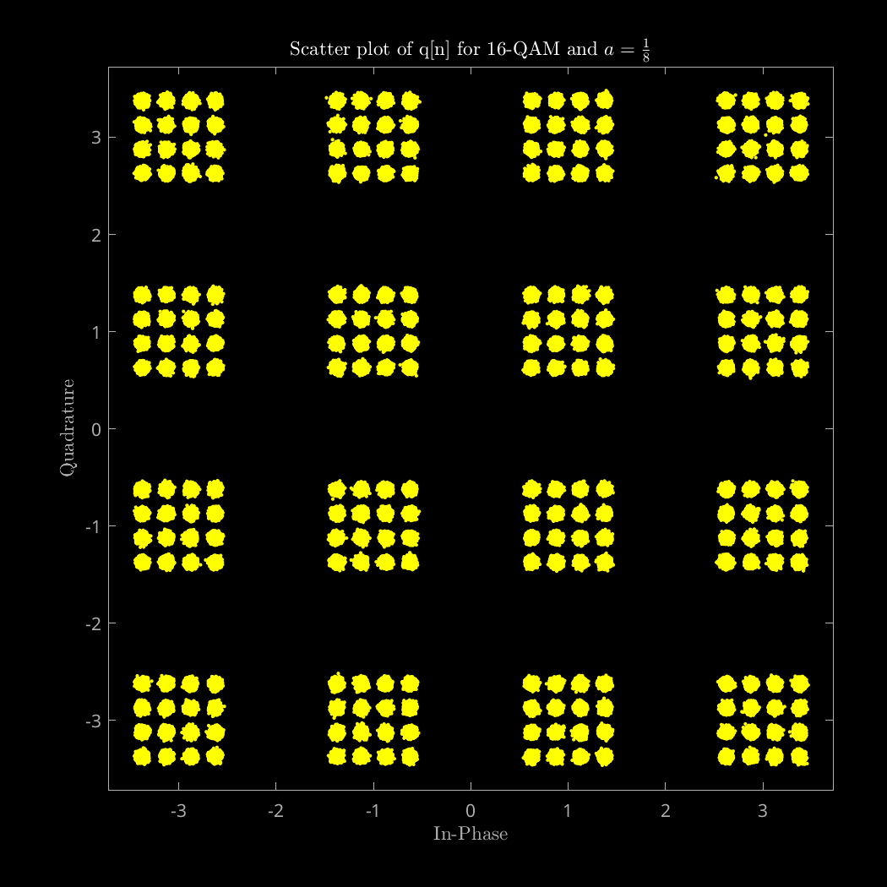
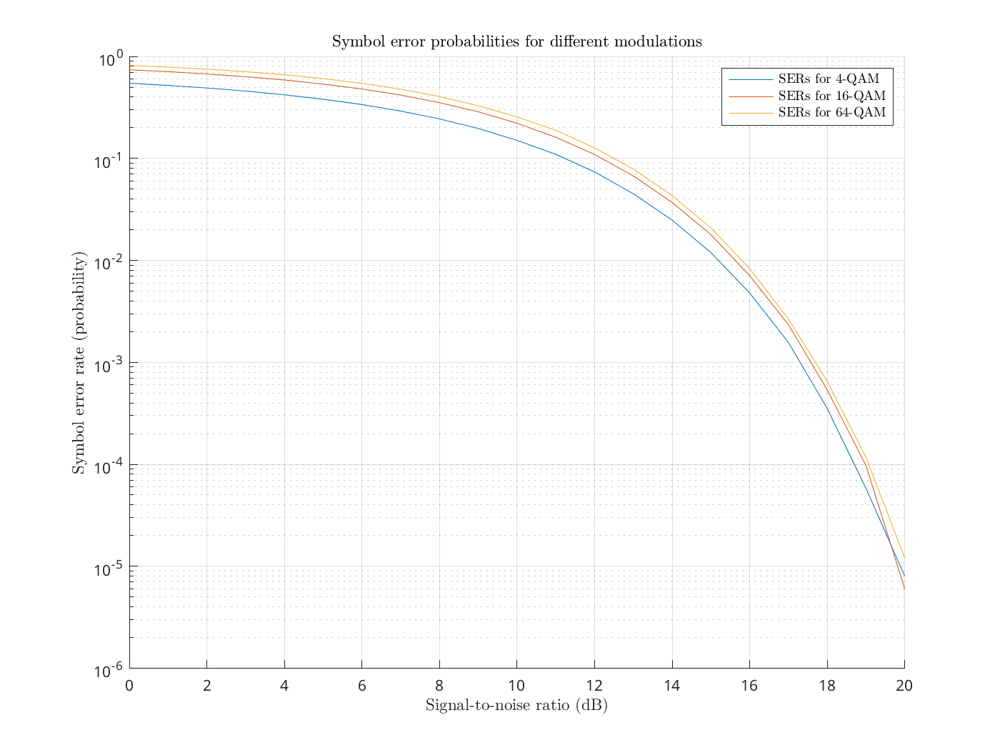

Communication Theory

# Lab 1 Report

Academic year 2024-2025

Alonso Herreros Copete

---

### Table of Contents

* [1. Signal-to-Noise ratio](#1-signal-to-noise-ratio)
* [2. Inter-symbol interference](#2-inter-symbol-interference)
* [3. Noise and error rates](#3-noise-and-error-rates)
    * [BER and SER](#ber-and-ser)
    * [SER-to-BER ratio](#ser-to-ber-ratio)

---

## 1. Signal-to-Noise ratio

As instructed, the dispersion diagram for the 16-QAM signal was created for
different SNRs, including the corresponding values of $N_0$. The results can be
found in the following figures.

Figure 1.1.0: Original 16-QAM signal.

Figure 1.1.1: q[n] observed at SNR = 20 dB.

Figure 1.1.1: q[n] observed at SNR = 15 dB.

Figure 1.1.1: q[n] observed at SNR = 10 dB.

Figure 1.1.1: q[n] observed at SNR = 5 dB.

As we can observe in the figures, as the SNR decreases, the signal becomes very
hard to interpret.

## 2. Inter-symbol interference

The dispersion diagrams requested were all created and can be found below. In
these experiments, sine the SNR is very high (40 dB), the received sequences
still look like they could be interpreted for the most part, except for the
cases with $a = \frac{1}{4}$ and a 16-QAM signal.

The results are displayed in the following table, where the first two rows
correspond to the experiment with the first discrete channel ($p[n] = δ[n] +
aδ[n-1]$) and the last two rows correspond to the experiment with the second
discrete channel ($p[n] = δ[n] + aδ[n-1] + \frac{a}{a} δ[n-2]$). The first and
third rows use 4-QAM modulation, while the second and fourth rows use 16-QAM
modulation.

| Original A[n] | q[n] with $a = \frac{1}{16}$ | q[n] with $a = \frac{1}{8}$ | q[n] with $a = \frac{1}{4}$ |
|---------------|-------------------------------|-----------------------------|-----------------------------|
|  |  |  |  |
|  |  |  |  |
|  |  |  |  |
|  |  |  |  |

## 3. Noise and error rates

As requested in the instructions, the bit error rate (BER), symbol error rate
(SER) and the SER/BER ratio were calculated for values of $\frac{E_b}{N_0}$
between 0 and 20 dB in steps of 1 dB using Gray coding for 4-QAM, 16-QAM and
64-QAM modulations.

The results of each metric were displayed in the same figure for all three
modulations, using logarithmic scales for the y-axis when necessary.

### BER and SER

The results for the bit and symbol error rates

As expected, the error probabilities decreased with the increase of
$\frac{E_b}{N_0}$, as the signal becomes more and more distinguishable from the
noise when the SNR is high. The values can be seen below.

Figure 3.1.1: Bit error rates

Figure 3.1.2: Symbol error rates

### SER-to-BER ratio

The SER/BER ratio is also very interesting: it shows some growth as
$\frac{E_b}{N_0}$ increases, but it seems to stabilize after a certain point.
Also, we can see that this ratio is always greater than 1, as we can see in the following grpah:

Figure 3.1.3: Relationship between SER and BER

This might seem counterintuitive at first, but it is actually expected:

* Given a symbol error, there is a guarantee of between 1 and $m$ bit errors,
  where $m$ is the number of bits per symbol. Given

As a corollary, we can never get more symbol errors than bit errors, nor more
bit errors than $m$ times the number of symbol errors,

So, when the BER is very low, it is almost guaranteed that each bit error is
isolated, and constitutes exactly 1 symbol error, giving a 1-to-1 bit error to
symbol error ratio. Since there are $m$ times as many bits as symbols, the
SER/BER ratio tends to $m$ for very low error rates.

Furthermore, since the maximum bit error to symbol error ratio is $m$, and
there are $m$ times as many bits as symbols, the SER/BER ratio tends to 1 for
very high error rates.
