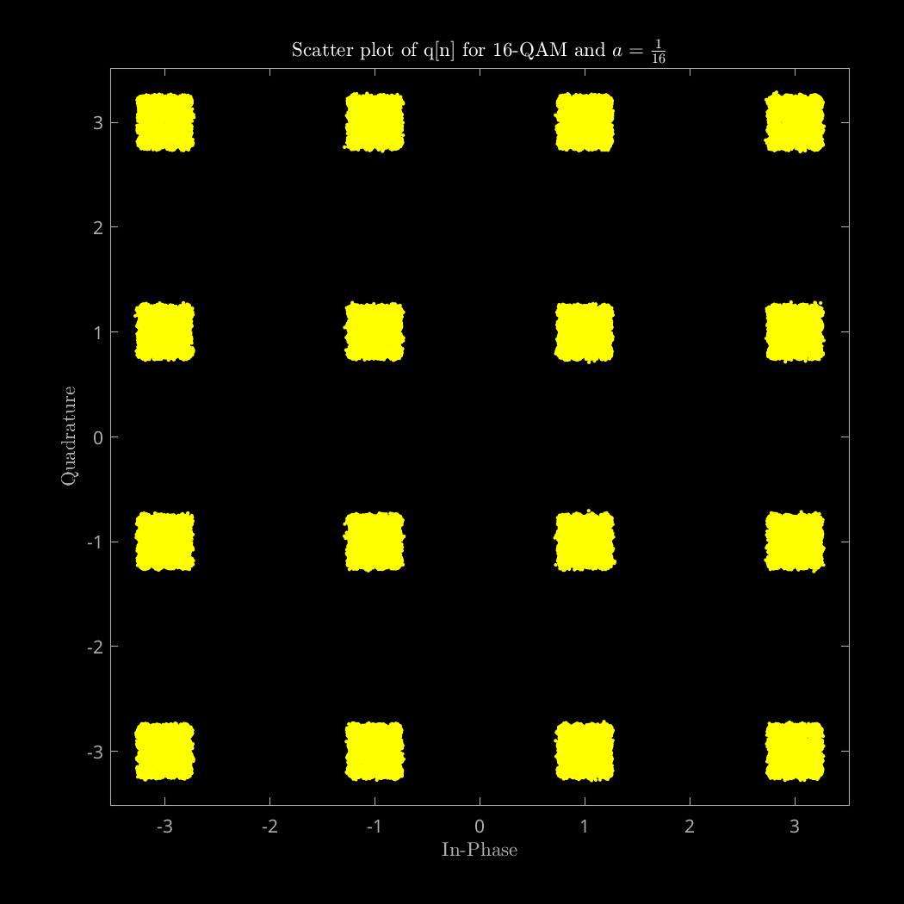

Communication Theory

# Lab 1 Report

Academic year 2024-2025

Alonso Herreros Copete

---

### Table of Contents

* [1. Signal-to-Noise ratio](#1-signal-to-noise-ratio)
* [2. Inter-symbol interference](#2-inter-symbol-interference)
* [3. Noise and BER](#3-noise-and-ber)

---

## 1. Signal-to-Noise ratio

As instructed, the dispersion diagram for the 16-QAM signal was created for
different SNRs, including the corresponding values of $N_0$. The results can be
found in the following figures.

Figure 1.1.0: Original 16-QAM signal.

Figure 1.1.1: q[n] observed at SNR = 20 dB.

Figure 1.1.1: q[n] observed at SNR = 15 dB.

Figure 1.1.1: q[n] observed at SNR = 10 dB.

Figure 1.1.1: q[n] observed at SNR = 5 dB.

As we can observe in the figures, as the SNR decreases, the signal becomes very
hard to interpret.

## 2. Inter-symbol interference

The dispersion diagrams requested were all created and can be found below. In
these experiments, sine the SNR is very high (40 dB), the received sequences
still look like they could be interpreted for the most part, except for the
cases with $a = \frac{1}{4}$ and a 16-QAM signal.

The results are displayed in the following table, where the first two rows
correspond to the experiment with the first discrete channel ($p[n] = δ[n] +
aδ[n-1]$) and the last two rows correspond to the experiment with the second
discrete channel ($p[n] = δ[n] + aδ[n-1] + \frac{a}{a} δ[n-2]$). The first and
third rows use 4-QAM modulation, while the second and fourth rows use 16-QAM
modulation.

| Original A[n] | q[n] with $a = \frac{1}{16}$ | q[n] with $a = \frac{1}{8}$ | q[n] with $a = \frac{1}{4}$ |
|---------------|-------------------------------|-----------------------------|-----------------------------|
|  |  |  |  |
|  |  |  |  |
|  |  |  |  |
|  |  |  |  |

## 3. Noise and BER
