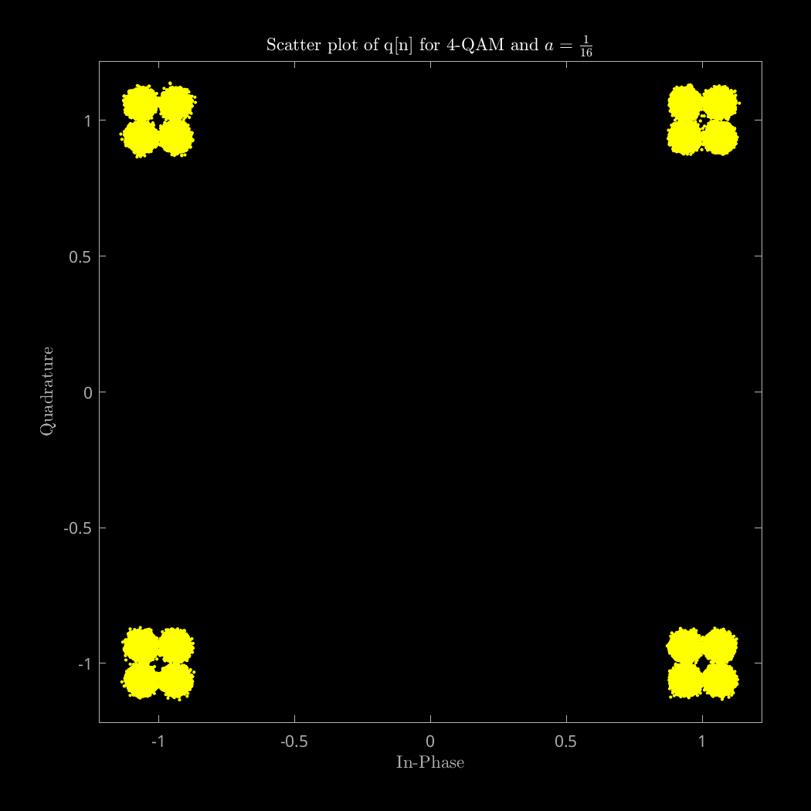
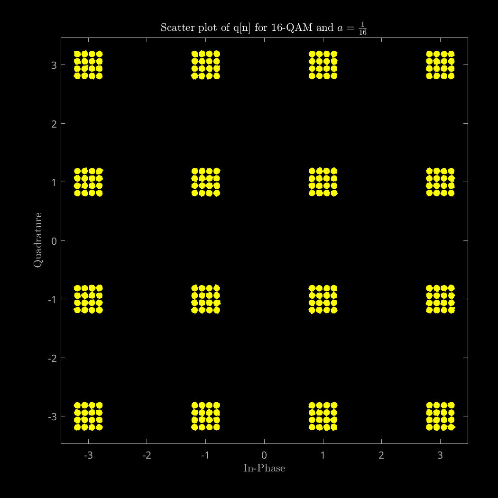
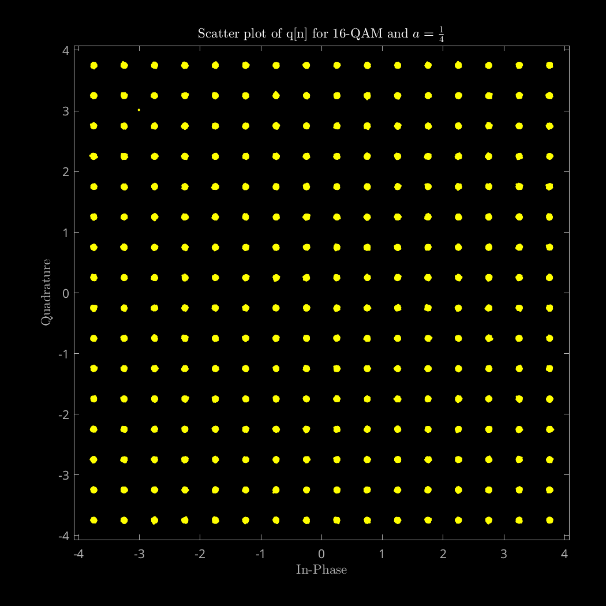
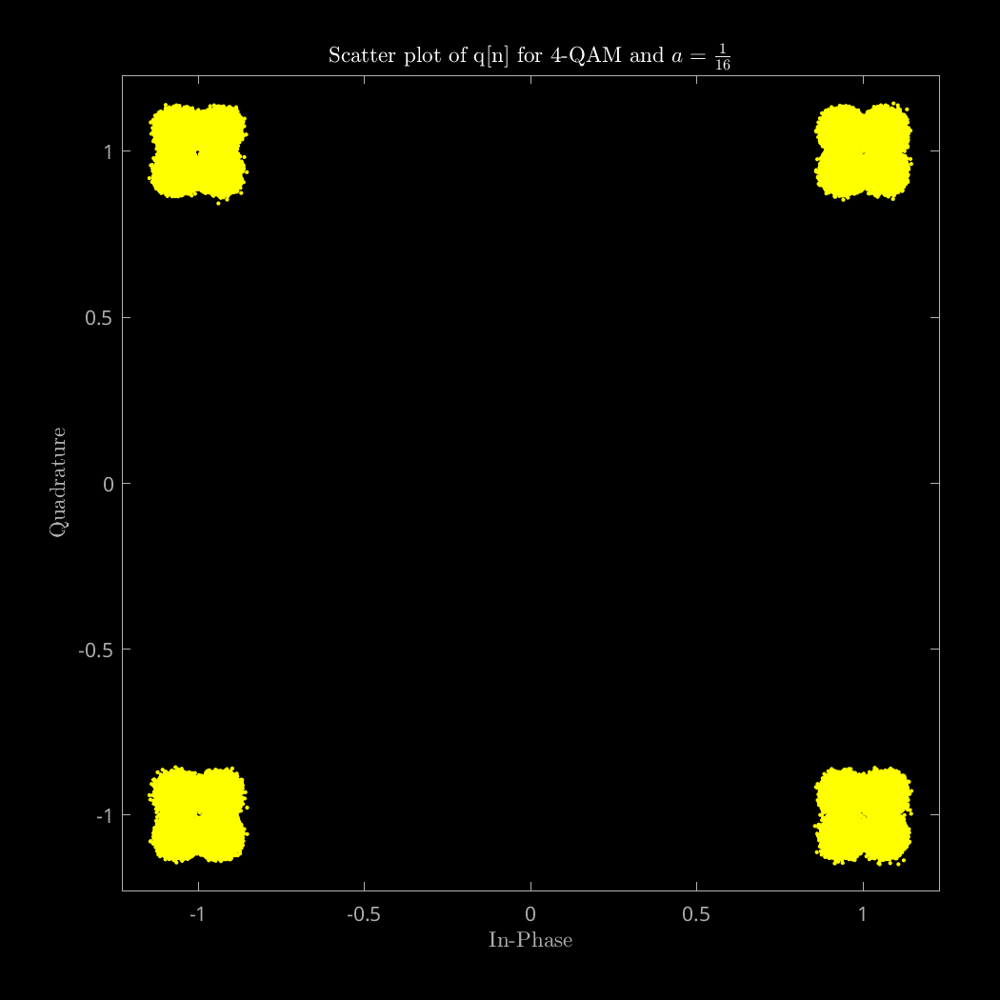
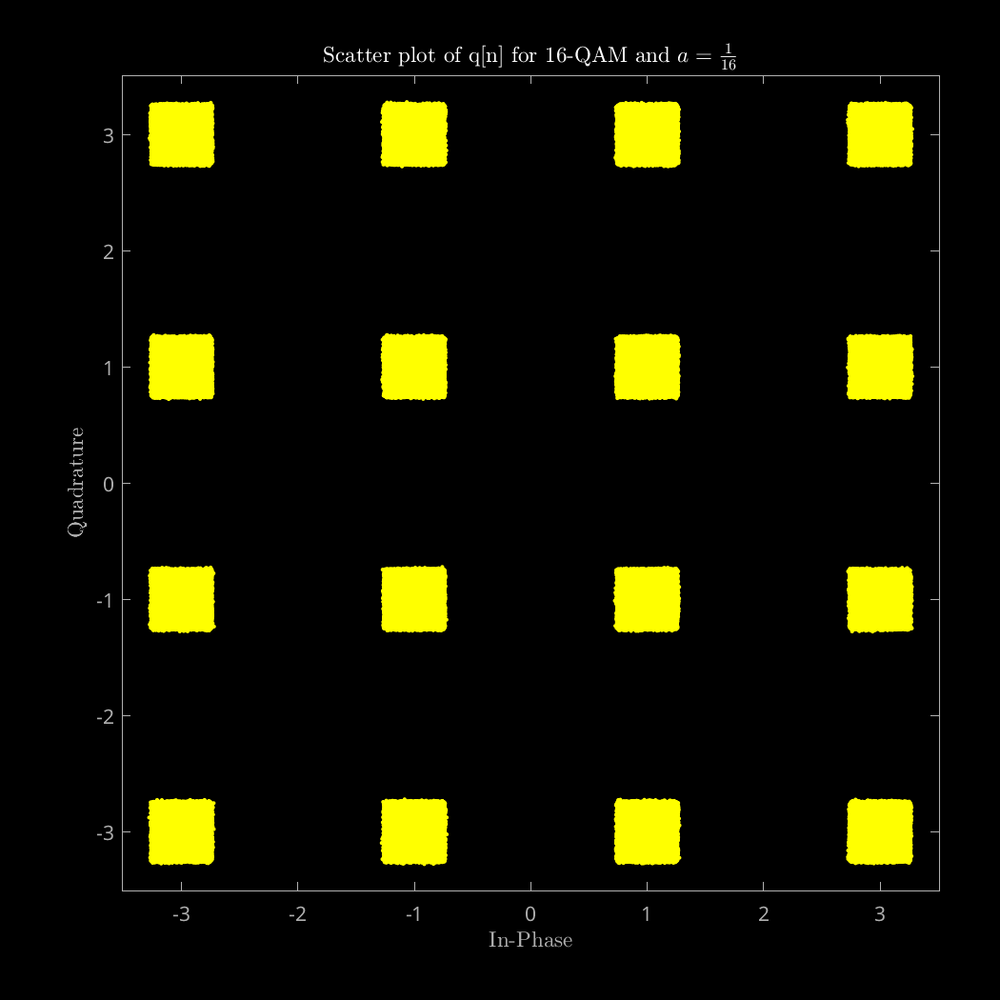
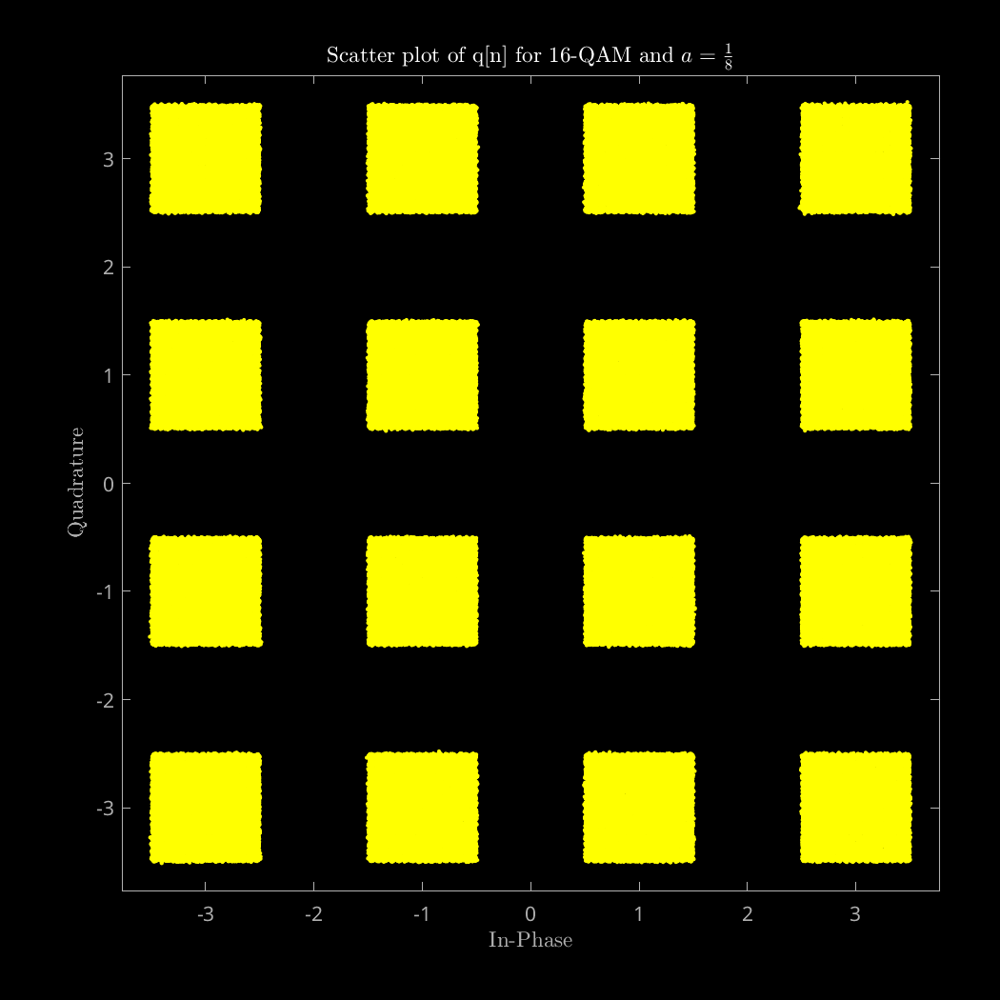
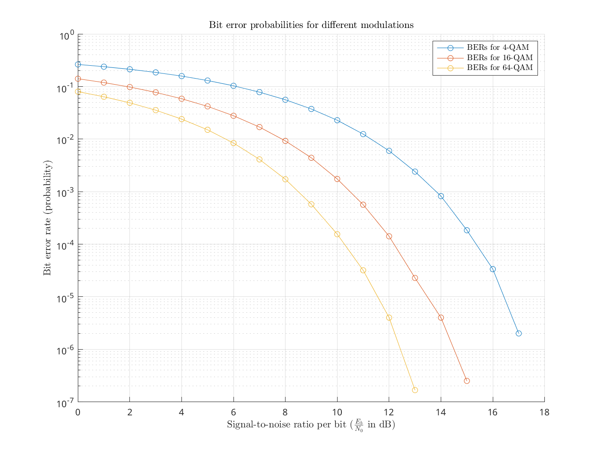
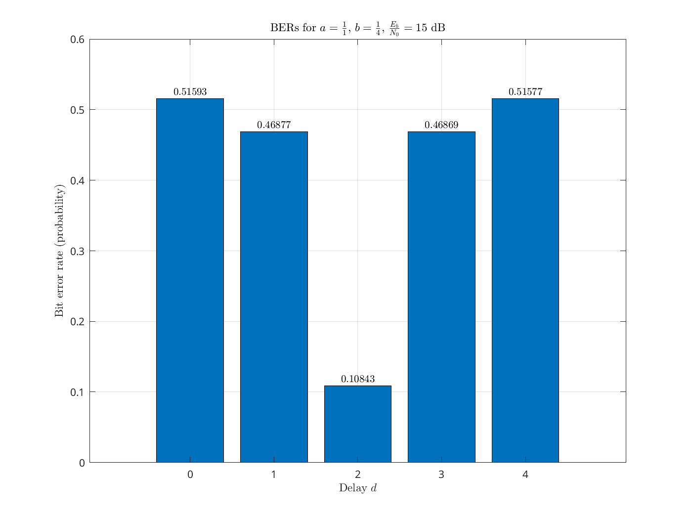
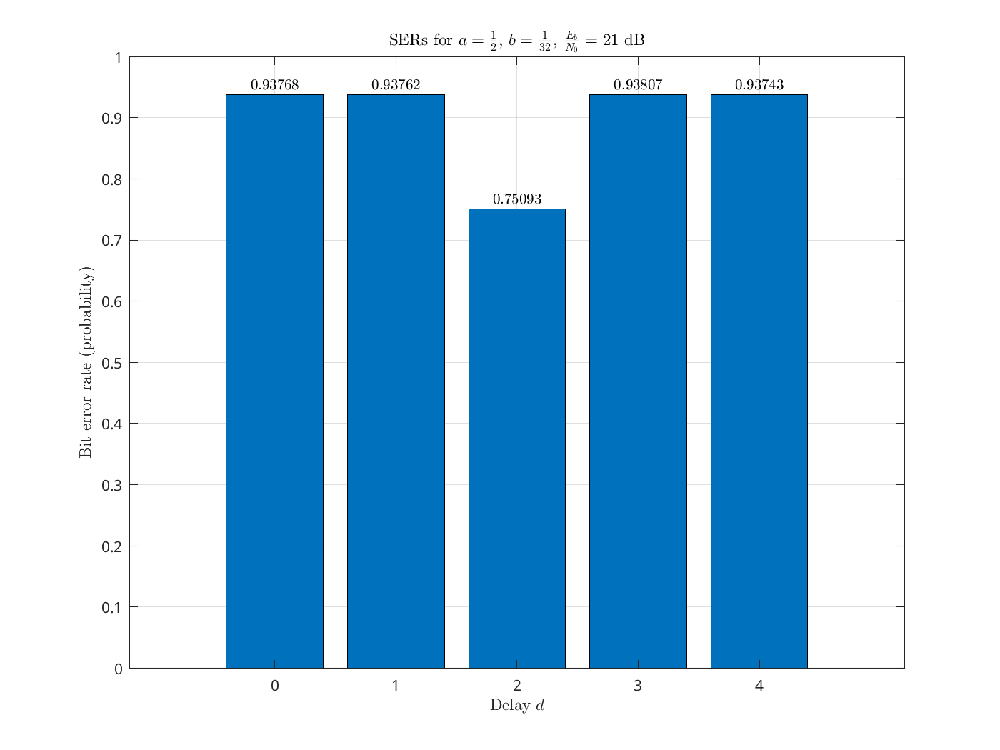

Communication Theory

# Lab 1 Report

Academic year 2024-2025

Alonso Herreros Copete

---

### Table of Contents

* [1. Signal-to-Noise ratio](#1-signal-to-noise-ratio)
* [2. Inter-symbol interference](#2-inter-symbol-interference)
* [3. Noise and error rates](#3-noise-and-error-rates)
* [4. ISI and error rates](#4-isi-and-error-rates)

> **Note**
>
> The code, figures and other resources used during the development of this
> lab session can be found in the following repository:  
> <https://github.com/alonso-herreros/uni-dcom-lab1>

---

## 1. Signal-to-Noise ratio

As instructed, the dispersion diagram for the 16-QAM signal was created for
different values of $\frac{E_b}{N_0}$ (also known as SNR per bit, which I have
abbreviated using SNRB or SNRb), including the corresponding values of $N_0$.
The results can be found in the following figures.

Figure 1.0: Original 16-QAM signal.

Figure 1.1: q[n] observed at SNRB = 20 dB.

Figure 1.2: q[n] observed at SNRB = 15 dB.

Figure 1.3: q[n] observed at SNRB = 10 dB.

Figure 1.4: q[n] observed at SNRB = 5 dB.

As we can observe in the figures, as the SNRB decreases, the signal becomes very
hard to interpret.

## 2. Inter-symbol interference

The dispersion diagrams requested were all created and can be found below. In
these experiments, sine the SNRB is very high (40 dB), the received sequences
still look like they could be interpreted for the most part, except for the
cases with $a = \frac{1}{4}$ and a 16-QAM signal.

The results are displayed in the following table, where the first two rows
correspond to the experiment with the first discrete channel ($p[n] = δ[n] +
aδ[n-1]$) and the last two rows correspond to the experiment with the second
discrete channel ($p[n] = δ[n] + aδ[n-1] + \frac{a}{a} δ[n-2]$). The first and
third rows use 4-QAM modulation, while the second and fourth rows use 16-QAM
modulation.

| Original A[n] | q[n] with $a = \frac{1}{16}$ | q[n] with $a = \frac{1}{8}$ | q[n] with $a = \frac{1}{4}$ |
|---------------|-------------------------------|-----------------------------|-----------------------------|
|  |  |  |  |
|  |  |  |  |
|  |  |  |  |
|  |  |  |  |

## 3. Noise and error rates

As requested in the instructions, the bit error rate (BER), symbol error rate
(SER) and the SER/BER ratio were calculated for values of $\frac{E_b}{N_0}$
between 0 and 20 dB in steps of 1 dB using Gray coding for 4-QAM, 16-QAM and
64-QAM modulations.

The results of each metric were displayed in the same figure for all three
modulations, using logarithmic scales for the y-axis when necessary.

### BER and SER

The results for the bit and symbol error rates

As expected, the error probabilities decreased with the increase of
$\frac{E_b}{N_0}$, as the signal becomes more and more distinguishable from the
noise when the SNRB is high. The values can be seen below. The missing data
points are are extremely low values, to the point where they may not even be
accurate, so they were omitted.

Figure 3.1: Bit error rates

Figure 3.2: Symbol error rates

### SER-to-BER ratio

The SER/BER ratio is also very interesting: it shows some growth as
$\frac{E_b}{N_0}$ increases, but it seems to stabilize after a certain point, as we can see in the following grpah:

Figure 3.3: Relationship between SER and BER

Also, we can see that this ratio is always greater than 1. These limits might
seem counterintuitive at first, but they are actually expected:

* Given a symbol error, there is a guarantee of between 1 and $m$ bit errors,
  where $m$ is the number of bits per symbol. Given

As a corollary, we can never get more symbol errors than bit errors, nor more
bit errors than $m$ times the number of symbol errors,

So, when the BER is very low, it is almost guaranteed that each bit error is
isolated, and constitutes exactly 1 symbol error, giving a 1-to-1 bit error to
symbol error ratio. Since there are $m$ times as many bits as symbols, the
SER/BER ratio tends to $m$ for very low error rates.

Furthermore, since the maximum bit error to symbol error ratio is $m$, and
there are $m$ times as many bits as symbols, the SER/BER ratio tends to 1 for
very high error rates.

## 4. ISI and error rates

As requested in the instructions, the bit error rate (BER) and symbol error rate
(SER) were calculated for values of $d$ between 0 and 4 in steps of 1, using
Gray coding for a 16-QAM.

The results of each metric were displayed in the same figure for all values of d
using bar plots, as it seemed appropriate.

### 4.1. $a=1$, $b=\frac{1}{16}$, SNRB = 15 dB

In this case, the difference between the probabilites of error was abysmal. This
is to be expected, since the difference between the coefficients of the discrete
equivalent channel is very high. For values of $d$ other than 2, the probability
of error was very close to 0.5, meaning that we had essentially no information
being transmitted.

For $d=2$, the probability of error was very low. This huge difference is show in
the figures in terms of the BER and SER.

Figure 4.1.1: Bit error rates for experiment 4.1

Figure 4.1.2: Symbol error rates for experiment 4.1

Clearly, the optimal value of $d$ is 2.

### 4.2. $a=1$, $b=\frac{1}{4}$, SNRB = 15 dB

In this case, the difference between the probabilites of error was not as
evindent as in the previous case, but it was still very significant. For values
of $d$ other than 2, the probability of error was very close to 0.5.

In fact, for $d=0$, and $d=4$, the probability of error was slightly greater
than 0.5, which means we were guessing wrong more often than not. This can be
reversed by guessing the opposite of what the demodulation algorithm says,
turning this probability of error into a probability of success, which would get
us a new probability of error $P_e' = 1 - P_e$

Still, the probability of error for $d=2$ was by far the lowest, as we can see
in the figures below.

Figure 4.2.1: Bit error rates for experiment 4.2

Figure 4.2.2: Symbol error rates for experiment 4.2

Again, the optimal value of $d$ is 2.

### 4.3. $a=\frac{1}{2}$, $b=\frac{1}{32}$, SNRB = 21 dB

This case was very similar to the first one, where the value of $b$ was also
$\frac{a}{16}$. As before, the probabilities of error for values of $d$ other
than 2 were very close to 0.5.

However, in this case, the probabilities of error for $d=2$ were much higher
than any other case. This is because, for this value of $d$, the coefficient
$p[d]$ was not 1, so the output sequence $q[n]$ should not be directly compared
to the expected constellation $A$.

The results can be seen in the following figures.

Figure 4.3.1: Bit error rates for experiment 4.3

Figure 4.3.2: Symbol error rates for experiment 4.3

### 4.4. $a=\frac{1}{2}$, $b=\frac{1}{32}$, SNRB = 21 dB, compensated

In this extra section, I adjusted the receiving algorithm to be able to account
for the coefficient of $p[d]$, and to scale the received sequence $q[d]$
accordingly. Before demodulating the sequence $q[n]$, I multiplied every symbol
by $\frac{1}{p[d]}$.

The results were very positive, returning to error probabilities very close to
the first case. The results can be seen in the following figures.

Figure 4.4.1: Bit error rates for experiment 4.4

Figure 4.4.2: Symbol error rates for experiment 4.4
